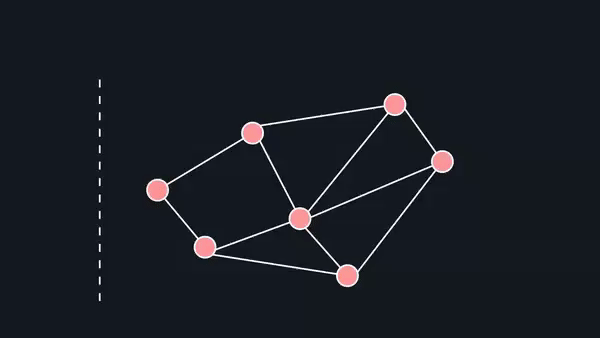
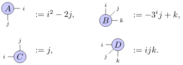

# SweepContractor.jl

A Julia package for the contraction of tensor networks using the sweep-line-based contraction algorithm laid out in the paper [General tensor network decoding of 2D Pauli codes](https://arxiv.org/abs/2101.04125). This algorithm is primarily designed for two-dimensional tensor networks but contains graph manipulation tools that allow it to function for generic tensor networks.



Below I have provided some examples of `SweepContractor.jl` at work. Scripts with working versions of each of these examples are also included in the package. For more detailed documentation consult help pages by using `?` in the Julia REPL.

Feel free to contact me with any comments, questions, or suggestions at [github@christopherchubb.com](mailto:github@christopherchubb.com). If you use `SweepContractor.jl` for research, please cite either [arXiv:2101.04125](https://arxiv.org/abs/2101.04125) and/or [doi:10.5281/zenodo.5566841](http://dx.doi.org/10.5281/zenodo.5566841).

## Example 1: ABCD

Consider the following four tensor networks, taken from the tensor network review [Hand-waving and Interpretive Dance](https://arxiv.org/abs/1603.03039):

>,

where each tensor is defined

>

First we need to install `SweepContract.jl`, which we do by running
```julia
import Pkg
Pkg.add("SweepContractor")
```
Now that it's install we can use the package by running
```julia
using SweepContractor
```
Next we need to define our network. We do this by initialising a `LabelledTensorNetwork`, which allows us to have a tensor network with elements labelled by an arbitrary type, in our case `Char`.
```julia
LTN = LabelledTensorNetwork{Char}()
```
Next, we populate this with our four tensors, which are each specified by giving a list of neighbouring tensors, an array consisting of the entries, and a two-dimensional location.
```julia
LTN['A'] = Tensor(['D','B'], [i^2-2j for i=0:2, j=0:2], 0, 1)
LTN['B'] = Tensor(['A','D','C'], [-3^i*j+k for i=0:2, j=0:2, k=0:2], 0, 0)
LTN['C'] = Tensor(['B','D'], [j for i=0:2, j=0:2], 1, 0)
LTN['D'] = Tensor(['A','B','C'], [i*j*k for i=0:2, j=0:2, k=0:2], 1, 1)
```
Finally, we want to contract this network. To do this we need to specify a target bond dimension and a maximum bond-dimension. In our case, we will use `2` and `4`.
```julia
value = sweep_contract(LTN,2,4)
```
To avoid underflows or overflows in the case of large networks `sweep_contract` does not simply return a float, but returns `(f::Float64,i::Int64)`, which represents a value`f*2^i`. In this case, it returns `(1.0546875, 10)`. By running `ldexp(sweep...)` we can see that this corresponds to the exact value of the network of `1080`.

Note there are two speedups that can be made to this code. Firstly, `sweep_contract` copies the input tensor network, so we can use the form `sweep_contract!` which allows the function to modify the input tensor network, skipping this copy step. Secondly, `sweep_contract` is designed to function on arbitrary tensor networks, and starts by flattening the network down into two dimensions. If our network is already well-structured, we can run the contraction in fast mode skipping these steps.
```julia
value = sweep_contract!(LTN,2,4; fast=true)
```

## Examples 2: 2d grid (open)

Next, we move on to the sort of network this code was primarily designed for, a two-dimensional network. Here consider an square grid network of linear size `L`, with each index of dimension `d`. For convenience, we can once again use a `LabelledTensorNetwork`, with labels in this case corresponding to coordinates in the grid. To construct such a network with Gaussian random entries we can use code such as:
```julia
LTN = LabelledTensorNetwork{Tuple{Int,Int}}();
for i∈1:L, j∈1:L
    adj=Tuple{Int,Int}[];
    i>1 && push!(adj,(i-1,j))
    j>1 && push!(adj,(i,j-1))
    i<L && push!(adj,(i+1,j))
    j<L && push!(adj,(i,j+1))
    LTN[i,j] = Tensor(adj, randn(d*ones(Int,length(adj))...), i, j)
end
```
We note that the `if` statements used have the function of imposing open boundary conditions. Once again we can now contract this by running the sweep contractor (in fast mode), for some choice of bond-dimensions χ and τ:
```julia
value = sweep_contract!(LTN,χ,τ; fast=true)
```
## Example 3: 2d grid (periodic)
But what about contracting a 2d grid with *periodic* boundary conditions? Well, this contains a small number of long-range bonds. Thankfully, however `SweepContractor.jl` can run on such graphs by first planarising them.

We might start by taking the above code and directly changing the boundary conditions, but this will result in the boundary edges overlapping other edges in the network (e.g. the edge from `(1,1)` to `(2,1)` will overlap the edge from `(1,1)` to `(L,1)`), which the contractor cannot deal with. As a crude workaround we just randomly shift the position of each tensor by a small amount:
```julia
LTN = LabelledTensorNetwork{Tuple{Int,Int}}();
for i∈1:L, j∈1:L
    adj=[
        (mod1(i-1,L),mod1(j,L)),
        (mod1(i+1,L),mod1(j,L)),
        (mod1(i,L),mod1(j-1,L)),
        (mod1(i,L),mod1(j+1,L))
    ]
    LTN[i,j] = Tensor(adj, randn(d,d,d,d), i+0.1*rand(), j+0.1*rand())
end
```
Here the `mod1` function is imposing our periodic boundary condition, and `rand()` is being used to slightly move each tensor. Once again we can now run `sweep_contract` on this, but cannot use fast-mode as the network is no longer planar:
```julia
value = sweep_contract!(LTN,χ,τ)
```
## Example 4: 3d lattice
If we can impose periodic boundary conditions, can we go further away from 2D? How about 3D? We sure can! For this we can just add another dimension to the above construction for a 2d grid:
```julia
LTN = LabelledTensorNetwork{Tuple{Int,Int,Int}}();
for i∈1:L, j∈1:L, k∈1:L
    adj=Tuple{Int,Int,Int}[];
    i>1 && push!(adj,(i-1,j,k))
    i<L && push!(adj,(i+1,j,k))
    j>1 && push!(adj,(i,j-1,k))
    j<L && push!(adj,(i,j+1,k))
    k>1 && push!(adj,(i,j,k-1))
    k<L && push!(adj,(i,j,k+1))
    LTN[i,j,k] = Tensor(
        adj,
        randn(d*ones(Int,length(adj))...),
        i+0.01*randn(),
        j+0.01*randn()
    )
end

value = sweep_contract!(LTN,χ,τ)
```
## Example 5: Complete network
So how far can we go away from two-dimensional? The further we stray away from two-dimensional the more inefficient the contraction will be, but for small examples arbitrary connectivity is permissible. The extreme example is a completely connected network of `n` tensors: 
```julia
TN=TensorNetwork(undef,n);
for i=1:n
    TN[i]=Tensor(
        setdiff(1:n,i),
        randn(d*ones(Int,n-1)...),
        randn(),
        randn()
    )
end

value = sweep_contract!(LTN,χ,τ)
```
Here we have used a `TensorNetwork` instead of a `LabelledTensorNetwork`. In a `LabelledTensorNetwork` each tensor can be labelled by an arbitrary type, which is accomplished by storing the network as a dictionary, which can incur significant overheads. `TensorNetwork` is built using vectors, which each label now needs to be labelled by an integer `1` to `n`, but can be significantly faster. While less flexible, `TensorNetwork` should be preferred in performance-sensitive settings.
